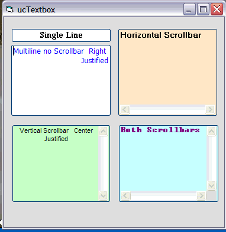



## ucTextbox

### Description

Just playing around. A usercontrol textbox that has XP look. Got scrollbars and align working.Not the best solution but seems to work okay.
 
### More Info
 

             |
---                |---
**Submitted On**   |2009-12-19 14:53:30
**By**             |[Kenneth Foster](https://github.com/Planet-Source-Code/PSCIndex/blob/master/ByAuthor/kenneth-foster.md)
**Level**          |Beginner
**User Rating**    |5.0 (10 globes from 2 users)
**Compatibility**  |VB 6\.0
**Category**       |[Custom Controls/ Forms/  Menus](https://github.com/Planet-Source-Code/PSCIndex/blob/master/ByCategory/custom-controls-forms-menus__1-4.md)
**World**          |[Visual Basic](https://github.com/Planet-Source-Code/PSCIndex/blob/master/ByWorld/visual-basic.md)
**Archive File**   |[ucTextbox21707812192009\.zip](https://github.com/Planet-Source-Code/kenneth-foster-uctextbox__1-72754/archive/master.zip)

